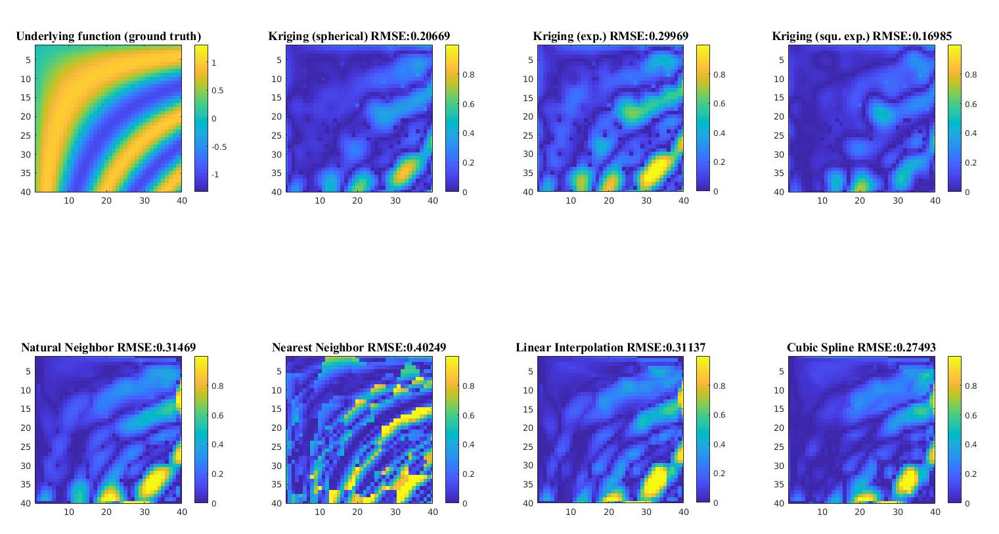

# PPE_Kriging
### Codes for Kriging interpolation

#### *for [project parameter estimation (PPE) course (HS2020) @ ETHZ](http://www.vvz.ethz.ch/Vorlesungsverzeichnis/lerneinheit.view?lang=en&semkez=2020W&lerneinheitId=140672&)*

#### Group member: Yue Pan & Fandré Josianne

#### Supervisor: Dr. Jemil Avers Butt

#### Link to project I of PPE: [TLS calibration](https://github.com/YuePanEdward/PPE_TLSCalibration)

-----

#### Goal: Implement the Kriging interpolation with various semivariogram models

#### Environment and Prerequisites:  Matlab (2019 or higher) 

------

#### Implementation details: 

TODO

#### Codes architecture:

TODO

### Demo:

#### DEM dataset:

*Semi-variogram:*

*Interpolation results:*

#### Dense dataset:

*Interpolation results:*

*Interpolation error:*

#### Sparse dataset:

*Interpolation error:*

-----

### Reference:

[Cressie 1990 Kriging](https://link.springer.com/article/10.1007/BF00889887):

Cressie, Noel. "The origins of kriging." *Mathematical geology* 22.3 (1990): 239-252.
